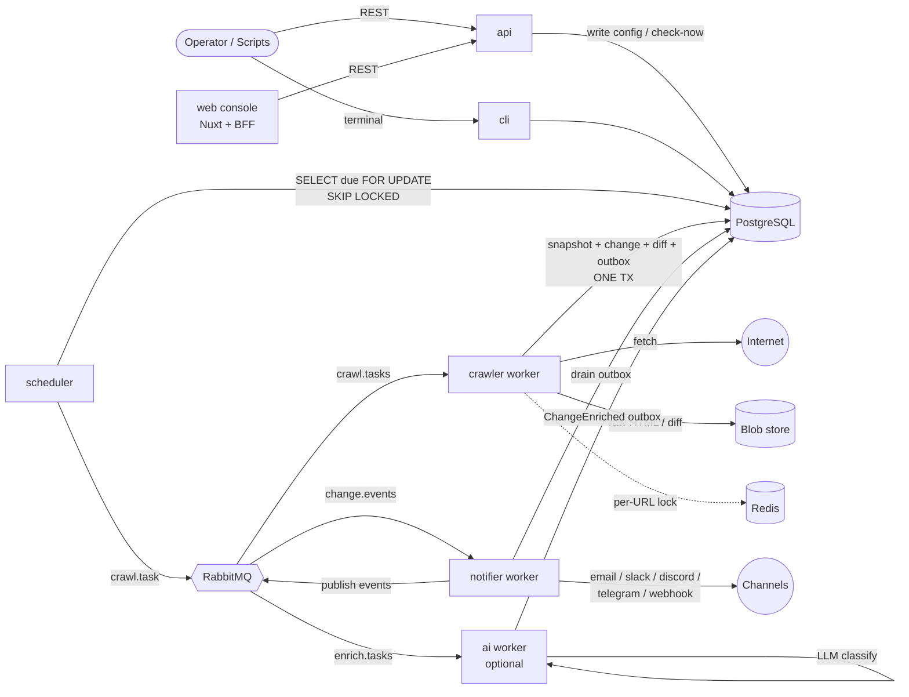

# 02 — Architecture

## Clean Architecture, applied

lens is organized as a **Clean Architecture** monorepo. Code is split into concentric
layers, and the **dependency rule** is strict: source dependencies only ever point
*inward*, toward the business model. Outer layers know about inner layers; inner layers
know nothing about the outer world.

```
            ┌──────────────────────────────────────────────┐
            │                  apps                        │  ← processes / images
            │   api · scheduler · crawler · notifier ·     │
            │   ai · cli   (+ web, separate TS app)        │
            │              ┌───────────────────────────┐   │
            │              │     infrastructure        │   │  ← adapters (DB, broker,
            │              │  ┌─────────────────────┐  │   │     crawler, notifier, …)
            │              │  │    application      │  │   │  ← use cases + ports (DTOs)
            │              │  │  ┌───────────────┐  │  │   │
            │              │  │  │    domain     │  │  │   │  ← pure business model
            │              │  │  └───────────────┘  │  │   │
            │              │  └─────────────────────┘  │   │
            │              └───────────────────────────┘   │
            └──────────────────────────────────────────────┘
                         common (shared kernel)
            cross-cutting utilities used by every layer & app
```

| Layer              | Package                                                                              | Responsibility                                                                                                                             | May depend on               |
|--------------------|--------------------------------------------------------------------------------------|--------------------------------------------------------------------------------------------------------------------------------------------|-----------------------------|
| **domain**         | `lens_domain`                                                                        | Pure business model: entities, value objects, enums, domain services, domain events. No I/O.                                               | `lens_common` (errors only) |
| **application**    | `lens_application`                                                                   | Orchestration: use cases, the **ports** (interfaces) the outer world must implement, and DTOs. No I/O code.                                | domain, common              |
| **infrastructure** | `lens_infrastructure`                                                                | Adapters that implement the ports against real systems (PostgreSQL, RabbitMQ, Redis, blob storage, HTTP, Apprise, LLM).                    | application, domain, common |
| **apps**           | `lens_api`, `lens_scheduler`, `lens_crawler`, `lens_notifier`, `lens_ai`, `lens_cli` | Thin **composition roots**: parse config, wire adapters to use cases, expose an entrypoint (HTTP server, tick loop, broker consumer, CLI). | all of the above            |
| **shared kernel**  | `lens_common`                                                                        | Config, logging, errors, dependency-injection container, metrics, health, lifecycle, retry, clock/id ports, pagination types.              | (nothing internal)          |

### Why this matters

- The **domain** and **application** layers contain all the business rules and are
  fully unit-testable with no database or network. They are type-checked under
  `mypy --strict`.
- The **ports** define the seam: anything external (a database, a broker, an LLM) is
  an interface in `application` and a swappable implementation in `infrastructure`.
- The **apps** are deliberately thin. Each one is a different way of *driving* the same
  application core: HTTP for the API, a timer for the scheduler, a queue consumer for
  the workers, a terminal for the CLI.

## Ports & adapters (the seam)

The application layer declares interfaces ("ports") such as `UnitOfWork`,
`CrawlerPort`, `DifferPort`, `TaskPublisherPort`, `EventConsumerPort`, `NotifierPort`,
`LockPort`, `BlobStoragePort`, and `ChangeClassifierPort`. The infrastructure layer
provides concrete adapters for each, and — importantly — also provides **in-memory
adapters** for almost every port. The in-memory variants make the entire system
runnable in a single process for tests and local development, with production adapters
(PostgreSQL, RabbitMQ, Redis) swapped in at composition time.

See [Messaging & scaling](06-messaging-and-scaling.md) and
[Data & storage](05-data-and-storage.md) for the concrete adapters.

## The six runtime roles

Each deployable service is the *same codebase* wired for a different job. They share
the database and broker; they do not call each other directly.

| Role          | Process                              | Drives                         | Core use case                                     |
|---------------|--------------------------------------|--------------------------------|---------------------------------------------------|
| **api**       | `lens-api` (FastAPI/uvicorn)         | HTTP requests                  | CRUD, import/export, trigger checks, read history |
| **scheduler** | `lens-scheduler` (tick loop)         | a timer                        | `EnqueueDueUrlsUseCase`                           |
| **crawler**   | `lens-crawler` (queue consumer)      | `crawl.tasks` queue            | `ProcessCrawlTaskUseCase`                         |
| **notifier**  | `lens-notifier` (relay + consumer)   | outbox + `change.events` queue | outbox publish + `Handle*EventUseCase`            |
| **ai**        | `lens-ai` (queue consumer, optional) | `enrich.tasks` queue           | `EnrichChangeUseCase`                             |
| **cli**       | `lens` (Typer)                       | terminal commands              | the same use cases as the API                     |

Plus the **web console** (`apps/web`) — a Nuxt 4 + PrimeVue application that is *not*
part of the Python workspace. It talks only to the REST API through a server-side
backend-for-frontend (BFF) that keeps the API key out of the browser.

## Data flow at a glance

Nothing calls anything else directly — every role coordinates through PostgreSQL,
RabbitMQ, Redis, and the blob store. The crawler *only* writes to the database (including
an outbox row); the notifier is the *only* role that publishes events and sends
notifications. That separation is what makes exactly-once delivery possible (see
[Messaging & scaling](06-messaging-and-scaling.md)).



1. An operator creates domains/categories/URLs via the **API** or **CLI**, which write
   to **PostgreSQL** through the application use cases.
2. The **scheduler** periodically queries PostgreSQL for due URLs and publishes a
   *crawl task* per URL to **RabbitMQ**, claiming each URL with a lease.
3. A **crawler worker** consumes a crawl task, takes a distributed lock, fetches the
   page, runs the change-detection pipeline, and — within a single database
   transaction — stores the snapshot/change/diff and writes any resulting domain event
   to the **outbox** table.
4. The **notifier worker** continuously drains the outbox to RabbitMQ and, as a
   consumer, routes/renders/sends notifications for each event.
5. If the AI tier is enabled and a change is escalated, the **AI worker** consumes the
   enrichment task, classifies the change with an LLM, and writes a follow-up event.

Each hop is made safe for multiple instances by the patterns in
[Messaging & scaling](06-messaging-and-scaling.md): row-level locking for due URLs,
distributed locks per URL, idempotency keys per task/notification, and the
transactional outbox for exactly-once event publication.

## Conventions baked into the layering

- **Constructor injection only** — no global singletons or service locators in business
  code. Apps wire dependencies in their composition root.
- **`domain` and `application` import no third-party I/O libraries** (only Pydantic, for
  validation/DTOs).
- **Value objects are frozen and self-validating**; entities expose behavior, not raw
  setters.
- **One use case = one class** with a single `async execute(...)` entrypoint, running
  inside one unit-of-work transaction.
- **Repositories return/accept domain entities**, never ORM rows.
- **All datetimes are timezone-aware UTC; all ids are UUIDv7.**

See [Development](12-development.md) for the full conventions and tooling.

## 📜 License

[AGPL-3.0-only](../LICENSE)
