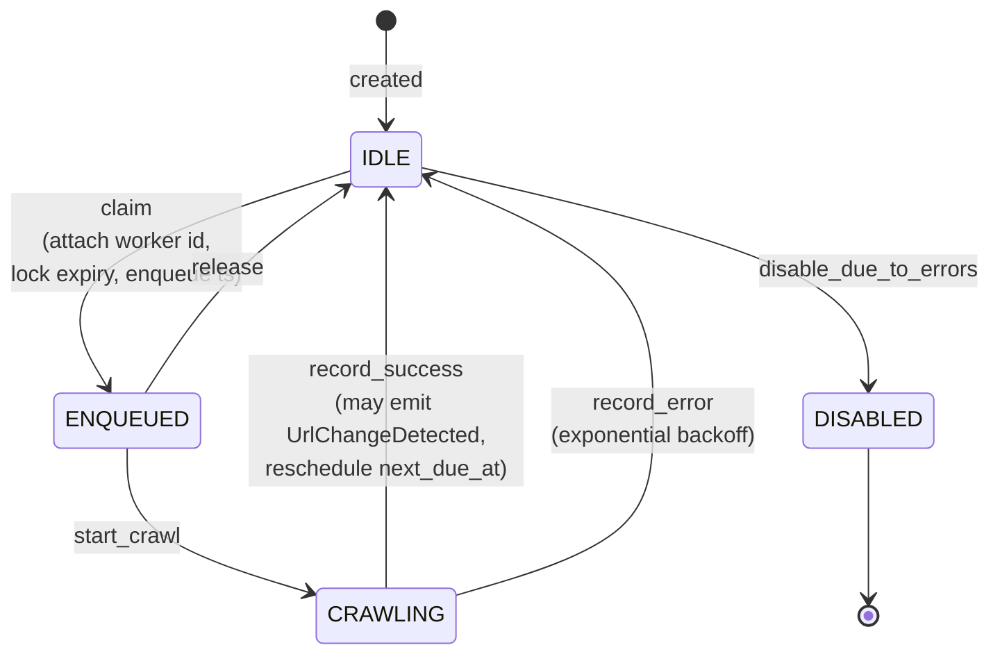

# 03 — Domain model

The domain model lives in `lens_domain` and is the heart of the system: pure business
rules with no database, network, or framework code. This document describes the model
in business terms. (For the implementation surface, see `libs/domain/README.md`.)

## Aggregates and entities

| Entity             | Identity     | What it represents                                                                                                                                        |
|--------------------|--------------|-----------------------------------------------------------------------------------------------------------------------------------------------------------|
| **Domain**         | `DomainId`   | A monitored website host. The aggregate root for defaults: crawl config, diff config, politeness, and notification routing that cascade down to its URLs. |
| **Category**       | `CategoryId` | A named grouping of URLs within a domain, with optional config overrides.                                                                                 |
| **Url**            | `UrlId`      | A single tracked page — the central entity. Owns its crawl lifecycle, scheduling interval, lease/lock state, and error backoff.                           |
| **Snapshot**       | `SnapshotId` | One stored, normalized capture of a URL, with a content hash and a reference to the raw HTML blob.                                                        |
| **Change**         | `ChangeId`   | A detected diff between two consecutive snapshots, with line counts, a significance flag, and enrichment metadata.                                        |
| **Channel**        | `UUID`       | A notification destination (an Apprise URL and a kind: email/slack/discord/telegram/webhook).                                                             |
| **ChannelBinding** | `UUID`       | Links a channel to a scope (global/domain/category/url) with trigger flags.                                                                               |
| **SiteProfile**    | `ProfileId`  | Per-domain, per-URL-pattern rules used by the deeper pipeline levels: zone selectors, significance rules, a template fingerprint, and a version.          |

Entities expose **behavior** (state transitions, validation, event emission) rather
than raw setters, and they are identified by id (two `Url`s with the same id are equal).
IDs are generated outside the domain (callers pass them in) and are UUIDv7.

## Value objects

Value objects are **immutable** (frozen) and **self-validating**: constructing one with
invalid data raises a `DomainError`. They carry meaning, not just data.

| Value object                                             | Captures                                                                                               |
|----------------------------------------------------------|--------------------------------------------------------------------------------------------------------|
| `Hostname`                                               | A normalized, lowercase DNS hostname.                                                                  |
| `Address`                                                | An absolute http/https URL, exposing scheme/host/path.                                                 |
| `ContentHash`                                            | A sha256 hex digest of normalized content.                                                             |
| `CrawlConfig`                                            | How to fetch: selector, wait, headers, proxy, timeout, JS toggle.                                      |
| `DiffConfig`                                             | How to compare: ignore regexes/selectors, significance rules, minimum text length, semantic threshold. |
| `Politeness`                                             | Per-host max concurrency and minimum delay between requests.                                           |
| `Interval`                                               | A polling interval in seconds, floored by a global minimum.                                            |
| `NotificationRouting`                                    | The set of channel ids and triggers to apply.                                                          |
| `SignificanceRule`                                       | A single text rule (ignore / trigger / must-not-be-present).                                           |
| `ZoneSelector`, `ZoneTextDelta`                          | A named CSS zone (with weight and a noise flag), and a per-zone text change with a score.              |
| `ChangeClassification`, `EmbeddingSignal`, `ChangeLabel` | AI-tier outputs: an LLM classification, lexical/semantic scores, and a human/LLM/rule label.           |

## The URL lifecycle (state machine)

A `Url` moves through a small set of statuses, and only specific transitions are
allowed (an illegal transition raises `InvalidStateTransition`):

```
        mark_due / created
              │
              ▼
          ┌──────┐   claim     ┌──────────┐  start_crawl  ┌──────────┐
          │ IDLE │ ──────────► │ ENQUEUED │ ────────────► │ CRAWLING │
          └──────┘             └──────────┘               └──────────┘
             ▲   ▲                  │                           │
             │   └─── release ──────┘                           │
             │                                                  │
             └────── record_success / record_error ─────────────┘
             │
             └── disable_due_to_errors ──► DISABLED
```



- **claim** attaches a worker id, a lock expiry, and an enqueue timestamp (the lease).
  Both the scheduler (when enqueuing) and the crawler (when starting work) participate
  in claiming, which together with distributed locks prevents double processing.
- **record_success** updates state, may emit a `UrlChangeDetected` event when a change
  was found, and reschedules the next due time.
- **record_error** applies **exponential backoff** before the next attempt: the base is
  at least the interval (min 60s), doubled per consecutive error, capped at 64× the
  base. Repeated failures can disable the URL.

```
next_attempt_delay = clamp(
    base = max(interval, 60s),
    grow = base · 2^(consecutive_errors - 1),   # doubled per consecutive error
    cap  = 64 × base
)
# repeated failures eventually → disable_due_to_errors → DISABLED
```

This is the contract the scheduler and crawler worker rely on; see
[Messaging & scaling](06-messaging-and-scaling.md).

## Effective configuration (precedence)

Crawl, diff, and routing settings can be specified at four levels. The
`EffectiveConfigResolver` domain service merges them with **most-specific-wins**
precedence:

```
URL  ►  Category  ►  Domain  ►  Global defaults
(most specific)                  (least specific)
```

For crawl/diff settings the merge is **field-level**: a more specific level overrides
only the fields it actually sets. For notification routing, a level that specifies
channels/triggers replaces the inherited set; otherwise it inherits.

## Significance evaluation

The `ChangeSignificanceEvaluator` domain service decides whether a textual change is
worth reporting (this is pipeline level **L5**, see
[Content pipeline](04-content-pipeline.md)). Rules are applied in order:

1. **Ignore** — strip lines matching `ignore_text` rules.
2. **Trigger** — if any `trigger_text` rules exist, require at least one match.
3. **Exclusion** — fail if any `text_must_not_be_present` rule matches.
4. **Minimum length** — require the remaining stripped text to meet `min_text_length`.

```
                stripped lines from the diff
                          │
    ┌─────────────────────▼─────────────────────────┐
    │ 1. IGNORE   strip lines matching ignore_text  │
    └─────────────────────┬─────────────────────────┘
                          ▼
    ┌────────────────────────────────────────────────┐
    │ 2. TRIGGER  if any trigger_text rules exist,   │
    │             require ≥1 match  ── else skip     │
    └─────────────────────┬──────────────────────────┘
                          ▼
    ┌────────────────────────────────────────────────┐
    │ 3. EXCLUSION  fail if text_must_not_be_present │
    └─────────────────────┬──────────────────────────┘
                          ▼
    ┌─────────────────────────────────────────────────┐
    │ 4. MIN LENGTH  remaining text ≥ min_text_length │
    └─────────────────────┬───────────────────────────┘
                          ▼
                   SIGNIFICANT ✓
```

## Notification routing

The `NotificationRouter` domain service resolves *which channels* should receive a
notification for a given event. It collects channel bindings across the global, domain,
category, and URL scopes, filters by the relevant trigger (on change / on error / on no
change), and applies most-specific-wins so a URL-level binding overrides a domain-level
one for the same channel.

## Domain events

Domain operations emit immutable events that become the payloads published through the
outbox (see [Message contracts](08-message-contracts.md)):

| Event                       | Emitted when                                                           |
|-----------------------------|------------------------------------------------------------------------|
| `UrlChangeDetected`         | A crawl produced a meaningful change.                                  |
| `UrlCrawlFailed`            | A crawl attempt failed.                                                |
| `UrlBecameStale`            | A URL has gone too long without a successful check (no-change signal). |
| `SiteTemplateDriftDetected` | The page's template skeleton changed materially.                       |
| `ChangeNeedsEnrichment`     | A change was escalated to the AI tier.                                 |
| `ChangeEnriched`            | The AI tier finished classifying a change.                             |

## Errors

Domain validation failures raise typed errors that all descend from `DomainError`
(in the shared kernel), e.g. `InvalidHostname`, `HostMismatch`, `DuplicateDomain`,
`InvalidInterval`, `InvalidScope`, `InvalidStateTransition`. Upper layers map these to
HTTP status codes (see [API reference](07-api-reference.md)).

## 📜 License

[AGPL-3.0-only](../LICENSE)
