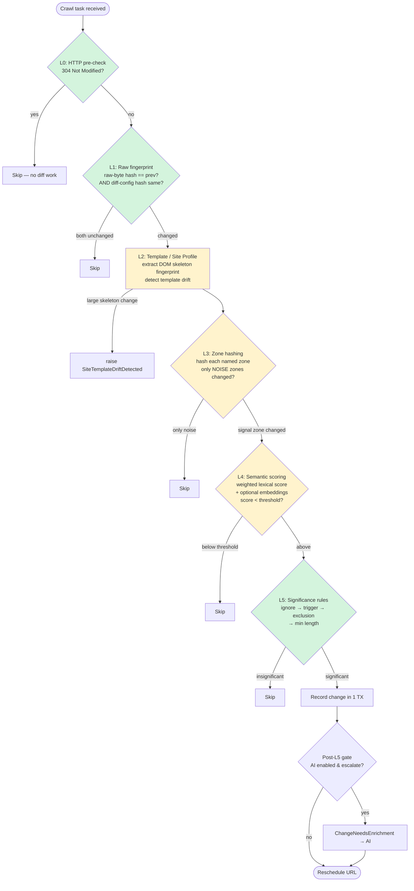

# 04 — Content-processing pipeline

The change-detection pipeline is the core algorithm: given a freshly fetched page and
the URL's prior state, decide whether a **meaningful** change occurred, and if so,
record it and (optionally) escalate it for AI enrichment.

The pipeline is orchestrated by `ProcessCrawlTaskUseCase` in the application layer; the
deeper levels delegate to infrastructure adapters (HTML fingerprinting, zone
extraction, semantic scoring). It is structured as a series of **levels (L0–L5)** that
act as progressively more expensive filters — cheap checks short-circuit early so the
expensive ones run rarely.

## Why levels?

Most pages, most of the time, have *not* meaningfully changed. The level structure is a
cost gradient: a byte-level hash is almost free, an LLM call is expensive. Each level
tries to answer "nothing meaningful changed — stop here" as early and as cheaply as
possible, and only escalates work it cannot rule out.

## The levels

| Level  | Name                    | What it does                                                                                                                | Outcome if it matches                                                                   |
|--------|-------------------------|-----------------------------------------------------------------------------------------------------------------------------|-----------------------------------------------------------------------------------------|
| **L0** | HTTP pre-check          | Honors HTTP `304 Not Modified` (and conditional-request headers).                                                           | Skip — no diff work at all.                                                             |
| **L1** | Raw fingerprint         | Compares a raw-byte hash of the response plus a hash of the active filter config.                                           | Skip if both unchanged (re-runs if the diff config changed, even when bytes are equal). |
| **L2** | Template / Site Profile | Extracts the DOM **skeleton fingerprint** and optionally classifies the page's platform/template. Detects *template drift*. | Informs zone selection; large skeleton change can raise a drift event.                  |
| **L3** | Zone hashing            | Splits the page into named **zones** (header, main, price, etc.) using the site profile's CSS selectors and hashes each.    | Skip if only **noise** zones changed.                                                   |
| **L4** | Semantic scoring        | Computes a weighted lexical change score per zone, optionally augmented by embedding-based semantic distance.               | Skip if the score is below the profile's threshold.                                     |
| **L5** | Significance rules      | Normalizes HTML to plain text, applies ignore regexes, and runs the domain `ChangeSignificanceEvaluator` rules.             | Skip if the change is insignificant; otherwise **record a change**.                     |

After L5, if a change is recorded and the AI tier is enabled, a **post-L5 gate** decides
whether to escalate the change to the AI worker (see below and
[AI enrichment](10-ai-enrichment.md)).

> **Green** levels (L0, L1, L5) are the always-on backbone. **Yellow** levels (L2–L4) are
> template-aware: they need a Site Profile and their adapters wired, and degrade
> gracefully to L5 when absent.

### What runs by default

L0, L1, and L5 are the always-on backbone. L2–L4 are **template-aware** levels that
require a Site Profile and the corresponding infrastructure adapters (template
fingerprint, zone extractor, semantic scorer) to be wired into the crawler worker.
They are implemented and degrade gracefully: when their adapters or a site profile are
absent, the pipeline falls through to the L5 significance rules. This means a brand-new
domain with no profile still works — it simply relies on ignore rules and significance
rules rather than zone-aware scoring.

## What happens when a change is detected

When L5 concludes a change is meaningful, `ProcessCrawlTaskUseCase` performs the
following **in a single database transaction**:

1. Store the raw normalized HTML as a **snapshot blob** and a `Snapshot` row.
2. Compute and store the **unified diff** as a blob, and a `Change` row (line counts,
   semantic score, significance, diff reference).
3. Update the URL's **check state** (raw hash, etag/last-modified, per-zone hashes and
   texts, previous cleaned text) so the next crawl can short-circuit.
4. Write a `UrlChangeDetected` event to the **outbox** (and, if escalated, a
   `ChangeNeedsEnrichment` event).
5. Advance the URL's lifecycle and reschedule its next due time.

Because the snapshot, change, diff, check-state, and outbox event are committed
together, the system never ends up with a recorded change that was never announced, or
an announced change with no stored diff. See
[Messaging & scaling](06-messaging-and-scaling.md) for the outbox guarantee.

## When nothing meaningful changed

If any level short-circuits, no snapshot or change is recorded. The URL is returned to
`IDLE` and rescheduled for its next interval. Optionally a "stale"/no-change signal can
be raised so that channels subscribed to *on-no-change* still hear from the system.

## When a crawl fails

Fetch and HTTP errors are recorded on the URL via `record_error`, which applies
exponential backoff (see [Domain model](03-domain-model.md)) and emits a
`UrlCrawlFailed` event for error notifications. Poison tasks that repeatedly fail are
routed to a dead-letter queue (see [Messaging & scaling](06-messaging-and-scaling.md)).

## The AI escalation gate (post-L5)

When the AI tier is enabled, a recorded change may be escalated for LLM enrichment. The
gate looks for signals such as:

- **Signal disagreement** — lexical and embedding scores disagree about how big the
  change is.
- **High-value zone** — the change touched an important zone (e.g. price, legal).
- **Gray band** — the score sits in an ambiguous range, neither clearly trivial nor
  clearly major.
- **Template drift** or an explicit **forced** flag on the profile.

If escalated, a `ChangeNeedsEnrichment` event is written to the outbox; the AI worker
then classifies the change and emits `ChangeEnriched`. The base L0–L5 pipeline is fully
functional with the AI tier disabled. See [AI enrichment](10-ai-enrichment.md).

## Site Profiles and learning

Site Profiles supply the zone selectors and significance thresholds that L2–L4 depend
on. They can be authored manually or **learned** from change history by the auto-learning
jobs (zone noise/signal mining and template clustering), run via the CLI. See
[AI enrichment](10-ai-enrichment.md#auto-learning).

## 📜 License

[AGPL-3.0-only](../LICENSE)
