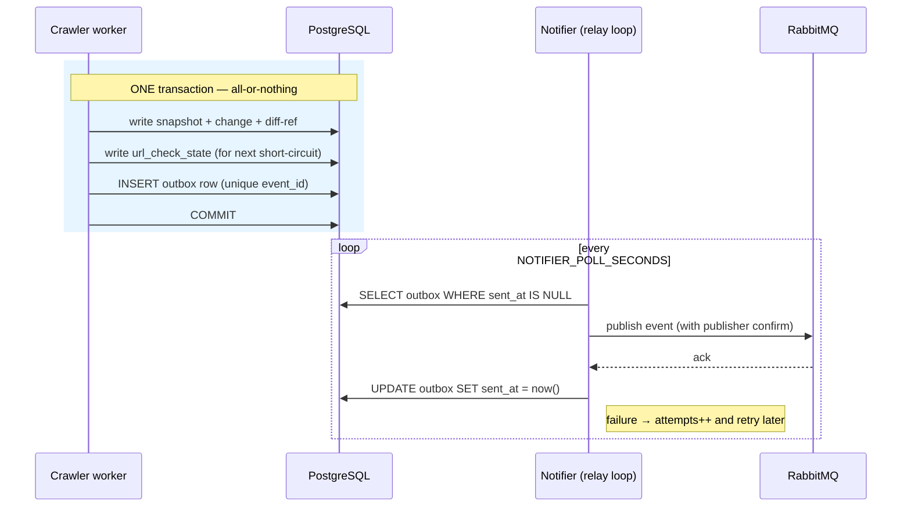
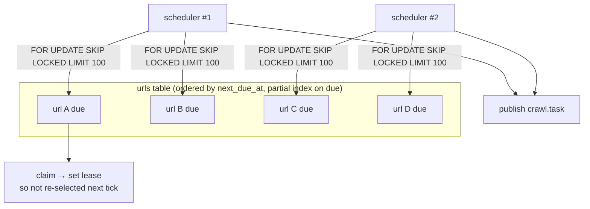
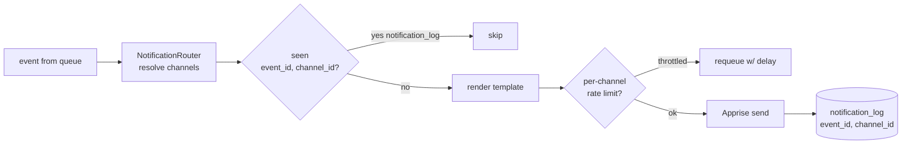

# 06 — Messaging & scaling

This document explains the patterns that let every role run as **many instances at once**
without double-processing work or duplicating data. These are the correctness
guarantees the whole fleet depends on.

## The moving parts

| Mechanism                    | Backed by                                    | Purpose                                                            |
|------------------------------|----------------------------------------------|--------------------------------------------------------------------|
| **Task queue**               | RabbitMQ                                     | Carries crawl tasks from scheduler → crawler.                      |
| **Event bus**                | RabbitMQ                                     | Carries domain events to the notifier and AI worker.               |
| **Transactional outbox**     | PostgreSQL `outbox` table                    | Publishes events *exactly once* despite crashes.                   |
| **Due-URL locking**          | PostgreSQL `SELECT … FOR UPDATE SKIP LOCKED` | Lets many schedulers/claimers share the URL table safely.          |
| **Per-URL distributed lock** | Redis                                        | Ensures only one crawler processes a given URL at a time.          |
| **Idempotency keys**         | Redis                                        | Drops duplicate task/notification deliveries.                      |
| **Throttle**                 | Redis                                        | Enforces per-host and per-channel rate limits.                     |
| **Dead-letter queue (DLQ)**  | Redis lists                                  | Holds messages that exhausted their retries for inspection/replay. |

In-memory implementations of all of these exist for single-process tests and local dev;
production wires the PostgreSQL/RabbitMQ/Redis adapters.

## RabbitMQ topology

| Exchange | Type   | Routing key(s)                                                            | Queue                    | Consumed by                          |
|----------|--------|---------------------------------------------------------------------------|--------------------------|--------------------------------------|
| `crawl`  | direct | `crawl.task`                                                              | `crawl.tasks` (quorum)   | crawler worker                       |
| `events` | topic  | `url.changed`, `url.failed`, `url.stale`, `site.drift`, `change.enriched` | `change.events` (quorum) | notifier worker                      |
| `enrich` | topic  | `change.enrich`                                                           | `enrich.tasks` (quorum)  | AI worker                            |
| `config` | fanout | —                                                                         | per-instance             | all roles (dynamic config broadcast) |

Queues are **quorum queues** (replicated, durable). Crawl-task publication uses
publisher confirms. See [Message contracts](08-message-contracts.md) for payloads.

## The transactional outbox

The classic problem: a worker updates the database *and* wants to publish an event. If
it publishes then crashes before commit, it announced a change that was rolled back; if
it commits then crashes before publishing, the change is lost to downstream consumers.

lens solves this with an **outbox**:

1. The crawl/enrich use case writes its domain changes **and** an `outbox` row in the
   **same transaction**. Either both land or neither does.
2. A separate **outbox relay** loop (run inside the notifier worker) polls unsent outbox
   rows and publishes them to RabbitMQ, marking each row sent on success and
   incrementing an attempt counter on failure.

This gives **at-least-once** publication with a stable `event_id`, which downstream
consumers combine with the notification log / idempotency keys to achieve effectively
exactly-once *delivery*.

```
crawler worker                     notifier worker (relay)
   │ one TX                            │ poll unsent
   ├─ write snapshot/change/diff       ├─ read outbox rows
   └─ write outbox row  ──────────────►├─ publish to RabbitMQ
                                       └─ mark row sent
```



## Scheduling without double-enqueue

The scheduler finds due URLs with `SELECT … FOR UPDATE SKIP LOCKED` ordered by
`next_due_at`. `SKIP LOCKED` means concurrent schedulers each grab a *different* batch
of rows instead of colliding on the same ones. Each enqueued URL is then **claimed**
(its lease fields set) so it is not re-selected on the next tick before the crawler
finishes.



## Crawling without double-processing

Even with at-least-once task delivery, a crawl task could be delivered twice. The
crawler worker defends in layers:

1. **Idempotency key** — `sha256(url_id | scheduled_slot)`. A duplicate task for the
   same slot is dropped.
2. **Per-URL distributed lock** (`lens:lock:url:{url_id}` in Redis) — a second worker
   that cannot take the lock skips the URL.
3. **Database claim/lease** — the URL state machine only allows one in-flight crawl.

The lock is released in a `finally` block so a crashed worker's lease expires and the
URL becomes eligible again.

```
Duplicate crawl.task delivered  ───────────────────────────────┐
                                                               ▼
   ┌──────────────────────────────────────────────────────────────────┐
   │ Layer 1: Idempotency key  sha256(url_id | scheduled_slot)        │
   │          (Redis) — same-slot duplicate is dropped                │
   ├──────────────────────────────────────────────────────────────────┤
   │ Layer 2: Per-URL distributed lock  lens:lock:url:{url_id}        │
   │          (Redis) — 2nd worker can't take lock → skips            │
   ├──────────────────────────────────────────────────────────────────┤
   │ Layer 3: DB claim / lease  state machine allows 1 in-flight      │
   │          crawl; lock released in finally → crash lease expires   │
   └──────────────────────────────────────────────────────────────────┘
```

## Notifying without duplicates

The notifier deduplicates per `(event_id, channel_id)` using the `notification_log`
table (and, when Redis is wired, an idempotency key `notification:{event_id}:{channel_id}`).
A change announced twice is therefore sent to each channel at most once.



Together the chain — outbox at-least-once publish + idempotency keys + `notification_log`
— turns at-least-once publication into effectively exactly-once **delivery**: each change
reaches each channel at most once, and crashes never lose it.

## Throttling (politeness & rate limits)

- **Per-host crawl politeness** — the throttle gate (`ThrottlePort`) enforces a minimum
  delay / max rate per domain host so lens behaves as a polite crawler. A throttled task
  is requeued with a delay rather than dropped.
- **Per-channel notification rate** — notifications are rate-limited per channel to avoid
  flooding a Slack webhook or mailbox.

## Retries and the dead-letter queue

Workers translate use-case outcomes into broker actions:

- **Success / skip** → acknowledge.
- **Throttled** → requeue after a delay.
- **Transient error** → retry with exponential backoff.
- **Exhausted retries / poison message** → move to the **dead-letter queue** for an
  operator to inspect, replay, or discard via the admin API (see
  [API reference](07-api-reference.md)).

## Horizontal scaling summary

| Role      | Scale by                                         | Made safe by                                                           |
|-----------|--------------------------------------------------|------------------------------------------------------------------------|
| api       | more replicas behind a load balancer (stateless) | nothing shared except DB; Redis-backed rate limiting for shared limits |
| scheduler | more replicas (optionally leader-elected)        | `FOR UPDATE SKIP LOCKED` + URL claim/lease                             |
| crawler   | more replicas / higher concurrency               | idempotency key + Redis lock + DB lease                                |
| notifier  | more replicas                                    | outbox relay + `notification_log` dedup                                |
| ai        | more replicas                                    | idempotency key + one-classification-per-change in DB                  |

> Operational note: the scheduler exposes shard/backpressure configuration knobs;
> confirm the shard filtering and queue-depth backpressure are active for your
> deployment before relying on them at very large scale, and prefer the
> `SKIP LOCKED` + lease combination as the primary safety mechanism.

## 📜 License

[AGPL-3.0-only](../LICENSE)
