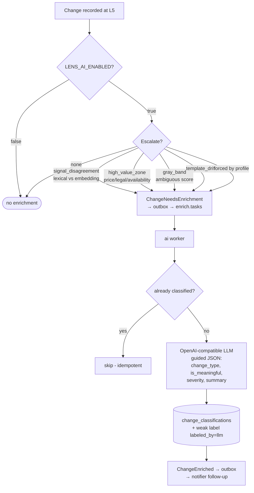

# 10 — AI enrichment (optional)

The AI tier is an **optional, disabled-by-default** layer that adds two capabilities on
top of the core L0–L5 pipeline:

1. **Embedding-augmented semantic scoring** at pipeline level L4.
2. **LLM classification & summarization** of the small fraction of changes that get
   *escalated*, performed asynchronously by the `ai_worker`.

Plus offline **auto-learning** jobs that mine Site Profiles from change history.

The entire core system runs fine with the AI tier off (`LENS_AI_ENABLED=false`). When
off, the crawler relies purely on lexical scoring and significance rules, and no
enrichment events are produced.

## Why a separate tier

LLM calls are expensive and slow relative to a crawl. The design keeps them off the hot
path: the crawler decides *cheaply* whether a change is ambiguous or high-value enough to
be worth an LLM opinion, and only those are escalated to a dedicated worker over the
broker. This bounds AI cost as a small fraction of total changes.

## Embeddings at L4

When enabled, the crawler can augment its lexical zone scoring (L4) with **embedding-based
semantic distance**: it embeds the previous and current zone texts and measures how far
apart they are in meaning, not just in wording. This catches meaning-preserving rewording
(low semantic distance → likely cosmetic) and meaning-changing edits that look small
lexically (high semantic distance → likely significant).

- Embeddings are produced behind `EmbeddingPort` (a local sentence-transformers model in
  the shipped adapter, with a safe fallback when the library is absent).
- Computed embeddings are cached in the `zone_embeddings` table keyed by
  `(model_id, text_hash)` to avoid recomputation.

## The escalation gate

After a change is recorded at L5, the **post-L5 gate** decides whether to escalate it.
Typical escalation reasons:

| Reason                | Meaning                                                                  |
|-----------------------|--------------------------------------------------------------------------|
| `signal_disagreement` | Lexical and embedding scores disagree about the magnitude of the change. |
| `high_value_zone`     | The change touched an important zone (price, legal, availability).       |
| `gray_band`           | The score is in an ambiguous middle range.                               |
| `template_drift`      | The page's template skeleton changed.                                    |
| `forced`              | The site profile explicitly forces enrichment.                           |

An escalated change produces a `ChangeNeedsEnrichment` outbox event (see
[Message contracts](08-message-contracts.md)).

The LLM's classifications become **weak labels** that feed the offline auto-learning jobs
below, which refine Site Profiles → improve L2–L4 → reduce future escalations. The system
gets cheaper over time.

## The AI worker

`lens-ai` consumes `ChangeNeedsEnrichment` tasks from the `enrich.tasks` queue and, for
each one:

1. Builds a classification request from the changed zone texts.
2. Calls an **OpenAI-compatible LLM** (e.g. a self-hosted vLLM/Ollama endpoint, or any
   compatible API) via the `ChangeClassifierPort` adapter, using guided JSON output for a
   structured result: `change_type`, `is_meaningful`, `severity`, `summary`, etc.
3. Persists the classification (one per change) and a **weak label**
   (`labeled_by = 'llm'`) for future learning/evaluation.
4. Sets the change's `enrichment_status` and writes a `ChangeEnriched` outbox event so the
   notifier can deliver an enriched follow-up notification.

Enrichment is **idempotent**: a change that already has a classification is not
re-processed. Failures are retried with backoff and ultimately dead-lettered.

## Notification interaction

Notifications can be tuned to interact with enrichment — for example, "notify then
enrich" (send a fast first alert, then a richer follow-up once the LLM classifies it).
The notifier suppresses changes the AI tier marks as not meaningful (or classifies as
cosmetic/layout).

## Auto-learning

Two offline jobs (run via the CLI) improve Site Profiles over time:

- **Zone learning** (`lens learn-zones`) — mines a domain's change history to distinguish
  **noise zones** (that change constantly and rarely matter) from **signal zones**, and
  proposes updated zone selectors/weights for the Site Profile.
- **Template clustering** (`lens cluster-templates`) — groups a domain's URLs by DOM
  skeleton to identify shared templates and detect drift.

There is also an evaluation job (`lens eval`) that replays labeled changes to measure the
pipeline's precision/recall, and a labeling command (`lens label`) to add human labels.

## Configuration

The AI tier is controlled by `LENS_AI_ENABLED` and the `LENS_LLM_*` / embedding settings
documented in [Configuration](09-configuration.md). The LLM endpoint is any
OpenAI-compatible server; no managed cloud provider is required.

## 📜 License

[AGPL-3.0-only](../LICENSE)
